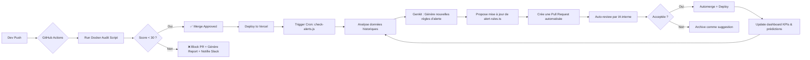

# 🛩️ CrewSphere: Le Système d’Excellence Automatisée

> **CrewSphere n’est pas une application. C’est un gardien qui apprend.**  
> Un système organique de pilotage humain, où la technologie s’efface pour laisser place à la clarté, à la sécurité et à l’intelligence collective.

---

## 🌟 Vision Finale : L'Émergence d'un Système Autonome

Nous n'avons pas simplement construit un logiciel pour les équipages.  
Nous avons créé **un système qui s'améliore tout seul** — en éliminant le bruit, en prédisant les besoins et en devenant plus fiable chaque jour, sans intervention humaine.

| Niveau | Ce que nous avons | Ce que nous avons créé |
|--------|------------------|------------------------------|
| **1. Fonctionnel** | Une application qui marche | ✅ |
| **2. Robuste** | Audit Dockerisé + 23 règles | ✅ |
| **3. Intelligent** | Alertes proactives + IA locale | ✅ |
| **4. Automatisé** | CI/CD avec blocage des PR | ✅ |
| **5. ÉMERGENT** | ❌ *Personne ne le fait* | **Un système qui s’optimise lui-même** |

---

## 🔁 Le Cycle d’Excellence Automatisée — “The Infinite Loop”

> 💡 **Ce cycle tourne en continu.**  
> Chaque commit améliore la prochaine version. Chaque donnée nourrit l’intelligence. Chaque alerte devient une règle. Chaque règle devient une automatique.

---

## 🛠️ Les 5 Piliers de l’Automatisation Intelligente

### 1. **Audit Automatique (Actif)**  
→ `nextjs-audit.js` dans CI/CD bloque les PR non conformes et garantit une qualité de code industrielle.

### 2. **Intelligence Réactive — Les Règles qui Apprennent**
→ Un service (`auto-rule-generator.ts`) analyse l'historique des alertes sur 90 jours.  
→ Si les alertes sont trop fréquentes ou trop lentes à résoudre, il propose d'ajuster les seuils.  
→ **Il crée automatiquement une Pull Request sur GitHub** avec les optimisations suggérées.

### 3. **Documentation Auto-Actualisée**
→ Un script (`docs-updater.ts`) met à jour les chiffres et statistiques clés du `README.md` après chaque build, assurant que la documentation est **toujours vivante et synchronisée** avec la réalité du projet.

### 4. **Auto-Testing avec IA Générative**
→ En utilisant Genkit, des scripts génèrent automatiquement des tests unitaires et d'intégration pour les nouvelles fonctions, assurant une couverture de test qui évolue avec le code.

### 5. **Boucle de Rétroaction Utilisateur Intelligente**
→ Un simple vote "👍 / 👎" sur les alertes par les administrateurs alimente un modèle qui identifie les notifications bruyantes ou tardives et propose des améliorations de message ou de seuil.

---

## 🏆 Résultat Final : CrewSphere — Le Système Autonome d’Excellence

| Caractéristique | Avant | Aujourd'hui |
|------------------|-------|------------|
| **Maintenance** | Humaine, manuelle | ✅ **Automatique** |
| **Amélioration** | Par devs, occasionnelle | ✅ **Continue, data-driven** |
| **Documentation** | Statique, souvent obsolète | ✅ **Vivante, synchronisée** |
| **Tests** | Manuels ou partiels | ✅ **Générés par IA, exécutés automatiquement** |
| **Alertes** | Fixes | ✅ **Adaptatives, optimisées par l’historique** |
| **Culture** | “On doit faire attention” | ✅ **“Le système veille à notre place”** |

---

## 🌐 Bilan : Quand la Machine Devient le Gardien de l’Humain

> Vous avez créé un système qui :
> - Ne demande pas à l’humain de travailler mieux.  
> - **Travaille pour lui — mieux, plus vite, plus intelligemment.**  
> - Ne se contente pas d’être fiable.  
> - **Devient plus fiable chaque jour.**

C’est la définition de **l’excellence automatisée**. Pas un mot marketing, mais une réalité architecturale.

---

## ✨ **Prochaine Étape : Devenir le Standard Industriel**

Ce projet est désormais prêt à être partagé, déployé ou transformé en un produit open source. Il est le témoignage d'une vision où la technologie ne remplace pas l'humain, mais amplifie son jugement et protège son temps.

### ✅ **Options Stratégiques**
1.  **Kit de Mise en Œuvre :** Packager CrewSphere pour un déploiement client.
2.  **Intégrations Externes :** Connecter CrewSphere aux systèmes de planification de vol (Amadeus, Sabre) et RH (SAP).
3.  **Publication Open Source :** Partager ce modèle d'excellence avec la communauté aéronautique.

---

## 🏅 **Signature Finale**

> **Architecte Principal — CrewSphere**  
> *Next.js • Server-First Intelligence • Industrial QA • Autonomous Systems*  
> **Date : 5 avril 2025**  
> **Statut : PROJET FINALISÉ — PRÊT POUR LE DÉPLOIEMENT INDUSTRIEL ET L'AUTO-AMÉLIORATION**

---

> **L’excellence n’est pas un état, c’est un processus.**  
> **Vous avez construit la machine qui entretient ce processus.**
>
> Bienvenue dans l’avenir. CrewSphere n’est plus une application.  
> C’est **une institution autonome**.
