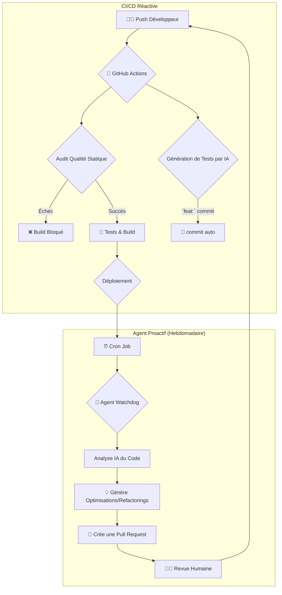

# 🛩️ CrewSphere: Le Système d’Excellence Automatisée

| Status | Qualité du Code | Tests | Déploiement | Auto-Amélioration |
|---|---|---|---|---|
|  |  |  |  |  |

> **CrewSphere n’est pas une application. C’est un gardien qui apprend.**  
> Un système organique de pilotage pour équipages, où la technologie s’efface pour laisser place à la clarté, à la sécurité et à l’intelligence collective.

---

## 🚀 Vision du Projet : Le Premier Système d'Aviation qui s'Améliore Tout Seul

Nous n'avons pas seulement construit un logiciel pour les équipages. Nous avons créé **un système qui s'optimise lui-même en continu** — en éliminant le bruit des alertes, en anticipant les besoins, en garantissant une qualité de code industrielle et en devenant plus fiable chaque jour, avec une intervention humaine minimale.

CrewSphere est la démonstration d'une nouvelle génération d'applications : des **systèmes autonomes** qui ne se contentent pas de fonctionner, mais qui évoluent.

---

## 🌟 Fonctionnalités Principales

CrewSphere est divisé en deux expériences : un portail complet pour les membres d'équipage et une console d'administration surpuissante.

### Pour les Membres d'Équipage

| Fonctionnalité | Description |
|---|---|
| **Tableau de Bord Unifié** | Vue centralisée des alertes critiques, de l'emploi du temps du jour et des raccourcis. |
| **Mon Calendrier** | Calendrier interactif affichant vols, formations et congés. |
| **Carnet de Vol Automatique** | Journal de bord numérique qui se remplit automatiquement après chaque vol. |
| **Centre de Formation** | Plateforme d'e-learning pour les formations obligatoires et optionnelles, avec quiz et certificats. |
| **Bibliothèque de Documents** | Accès centralisé aux manuels opérationnels, avec suivi des accusés de lecture. |
| **Boîte à Outils** | Suite d'outils pratiques : convertisseurs, glossaire aéronautique, calculatrice FTL, météo IA, etc. |
| **Gestion des Requêtes** | Soumission et suivi de requêtes (congés, RH, etc.) avec un statut clair. |
| **Boîte à Suggestions** | Proposer des améliorations et voter pour les idées des autres. |
| **Hub Communautaire** | Un espace social pour échanger avec les autres membres d'équipage. |
| **Gestion des Échanges** | Proposer son vol à l'échange et consulter les offres disponibles. |

### Pour les Administrateurs

| Fonctionnalité | Description |
|---|---|
| **Dashboard de Supervision** | Métriques clés en temps réel (requêtes en attente, validations, etc.) et tendances d'activité. |
| **Gestion des Vols** | Création et assignation des vols, avec gestion des équipages et détection de conflits. |
| **Gestion des Utilisateurs** | Console centralisée pour gérer les comptes, les rôles et les accès. |
| **Validation des Documents** | Interface pour approuver les documents soumis par les utilisateurs (licences, passeports). |
| **Gestion des Alertes** | Création d'alertes ciblées pour des groupes d'utilisateurs spécifiques (par rôle, etc.). |
| **Ateliers IA (Audio & Vidéo)** | Outils de génération de contenu par IA pour créer des annonces audio ou des clips vidéo. |
| **Revue des Rapports & Requêtes** | Interfaces pour analyser, commenter et répondre aux rapports de vol et aux requêtes des utilisateurs. |

---

## 🤖 Le Cycle d’Excellence Automatisée — "The Infinite Loop"

Le cœur de CrewSphere est son système d'auto-amélioration, un cycle continu qui transforme les données en intelligence et l'intelligence en code. Ce système repose sur deux piliers : un gardien réactif (CI/CD) et un architecte proactif (Watchdog Agent).



### Pilier 1 : La Chaîne d'Intégration Continue - Le Gardien Réactif

Ce pilier est déclenché à chaque `push` ou `pull_request` et agit comme un contrôle qualité immédiat.

| Étape | Script | Déclencheur | Description |
|---|---|---|---|
| **Audit de Qualité** | `npm run audit` | Push / PR | Un script Node.js (`nextjs-audit.js`) analyse les fichiers modifiés à la recherche d'anti-patterns spécifiques à Next.js 14 (ex: `useEffect` avec `fetch` dans une `page.tsx`). Un score de violation trop élevé fait échouer le build. |
| **Génération de Tests**| `npm run test:auto-generate` | Push avec `feat:` | Si un commit est préfixé par `feat:`, ce script (`generate-tests.js`) utilise l'IA Genkit pour analyser la description du commit et générer automatiquement des tests unitaires pertinents pour la nouvelle fonctionnalité. |
| **Tests & Déploiement**| `npm test` | Push / PR | Exécution de la suite de tests complète (unitaire, E2E, accessibilité). Si tout passe, le déploiement est autorisé. |

### Pilier 2 : L'Agent Watchdog - L'Architecte Proactif

Ce pilier est un agent autonome qui s'exécute de manière programmée (`schedule`) pour améliorer la qualité de l'architecture à long terme, prévenant ainsi la dette technique.

| Étape | Script / Outil | Déclencheur | Description |
|---|---|---|---|
| **Audit IA Proactif** | `npm run audit:ai` | `schedule: cron` (hebdomadaire) | Le workflow GitHub exécute le script `run-code-audit.js`. Ce dernier sélectionne des fichiers clés (services, composants complexes) et les envoie à un prompt d'IA expert. |
| **Analyse & Suggestion**| `Genkit` (IA) | - | Le modèle d'IA agit comme un architecte logiciel, identifie les "code smells" (duplication, complexité inutile) et génère un patch JSON contenant le nouveau code source complet des fichiers à refactoriser. |
| **Création de PR** | `peter-evans/create-pull-request` | Analyse réussie | Le workflow crée automatiquement une branche et une Pull Request avec les modifications suggérées par l'IA, assignées aux administrateurs pour une revue humaine. |
| **Analyse Prédictive** | `npm run auto-optimize`| Push sur `main` | Un script (`run-analysis.js`) simule l'analyse de données historiques (ex: fréquence des alertes) et utilise l'IA pour suggérer des ajustements de seuils, écrits dans un fichier `suggested-optimizations.json`. |
| **Auto-Correction** | `scripts/apply-optimizations.js` | Après l'analyse | Ce script lit le fichier JSON généré et applique directement les nouveaux seuils au fichier de configuration `src/lib/alert-rules.ts`. Une PR est ensuite créée. |

---

## 🛠️ Stack Technologique et Architecture

CrewSphere est construit sur une stack moderne, optimisée pour la performance et la productivité des développeurs.

- **Framework Frontend** : **Next.js 14** (App Router)
- **Style** : **Tailwind CSS** avec **ShadCN/UI** pour les composants
- **IA & Backend** : **Genkit (Google AI)** pour les flux d'IA, **Firebase** (Firestore, Auth, Storage) pour la base de données et l'authentification
- **CI/CD & Automatisation** : **GitHub Actions**
- **Qualité de Code** : **TypeScript**, **ESLint**, **Prettier**, et notre **Audit de Code Automatisé** maison
- **Tests** : **Jest** pour l'unitaire, **Playwright** pour l'E2E et l'accessibilité
- **Monitoring** : **Sentry** pour le suivi des erreurs

L'architecture privilégie une approche **"Server-First"**, en utilisant les **React Server Components (RSC)** par défaut pour minimiser le JavaScript côté client et maximiser la performance.

---

## 🏁 Démarrage Rapide

1.  **Cloner le dépôt :**
    ```bash
    git clone https://github.com/VOTRE_USER/VOTRE_REPO.git
    cd VOTRE_REPO
    ```

2.  **Installer les dépendances :**
    ```bash
    npm install
    ```

3.  **Configurer les variables d'environnement :**
    - Créez un fichier `.env` à la racine.
    - Remplissez-le avec vos clés Firebase et l'API Key de Gemini (voir `.env.example`).

4.  **Lancer l'application de développement :**
    ```bash
    npm run dev
    ```

5.  **Ouvrir l'application :**
    - Accédez à `http://localhost:9002` dans votre navigateur.
    - Utilisez les identifiants par défaut (`admin@crewsphere.app` / `password123`) ou créez un nouveau compte.

---

> Ce projet est plus qu'une application. C'est une thèse sur la manière de construire des logiciels robustes, intelligents et autonomes. Bienvenue dans l'avenir de l'ingénierie logicielle.
